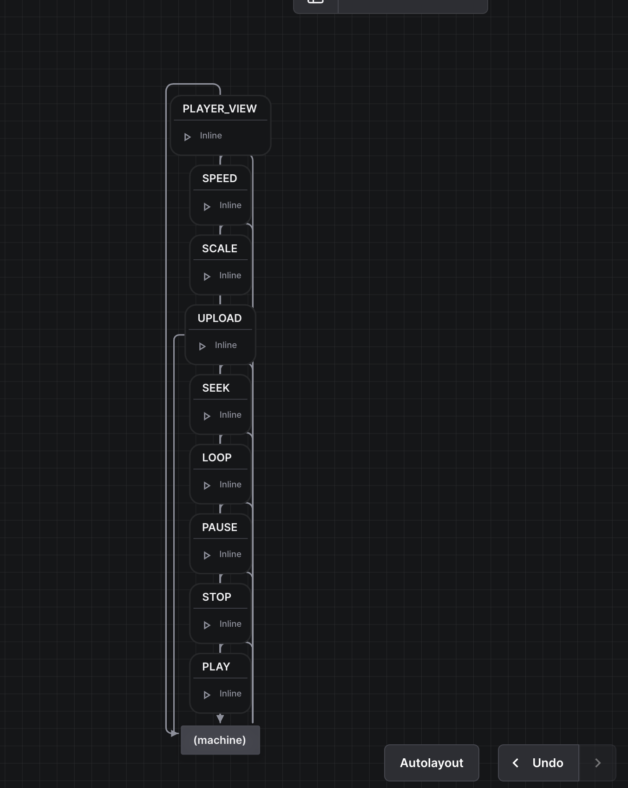

# Lottie Animation Player Project

## Project Overview
A React-based Lottie animation player that provides a flexible and reusable component for displaying and controlling Lottie animations. Built with React, TypeScript, and Vite, this project offers a robust solution for implementing Lottie animations in web applications.

## Technologies Used
- React 
- TypeScript
- Vite
- Lottie-web
- ESLint
- Tailwind CSS (for styling)

## Features
- Customizable animation playback
- Animation control methods (play, pause, stop)
- Frame navigation
- Loop control
- Autoplay support
- Multiple renderer options (SVG, Canvas, HTML)
- Event handling for animation loading and completion

## Component Documentation

### LottieWeb Component

#### Props Interface
```typescript
interface LottieWebProps {
  src?: string;              // URL of the Lottie animation JSON
  onLoad?: (container?: HTMLDivElement | null) => void;  // Callback when animation loads
  onComplete?: () => void;   // Callback when animation completes
  loop?: boolean;            // Controls if animation should loop
  autoplay?: boolean;        // Controls if animation should autoplay
  renderer?: "svg" | "canvas" | "html";  // Animation renderer type
}
```

```typescript 
interface LottieWebRef {
  play: () => void;          // Start the animation
  pause: () => void;         // Pause the animation
  stop: () => void;          // Stop the animation
  goToAndStop: (frame: number, isFrame?: boolean) => void;  // Go to specific frame
  getDuration: (inFrames?: boolean) => number;              // Get animation duration
  setLoop: (loop: boolean) => void;                         // Set loop behavior
}
```

```typescript
import { useRef } from 'react';
import LottieWeb, { LottieWebRef } from './components/player/LottieWeb';

function App() {
  const lottieRef = useRef<LottieWebRef>(null);

  return (
    <div>
      <LottieWeb
        ref={lottieRef}
        src="path/to/animation.json"
        autoplay={true}
        loop={true}
      />
    </div>
  );
}
```

```typescript
function App() {
  const lottieRef = useRef<LottieWebRef>(null);

  return (
    <div>
      <LottieWeb
        ref={lottieRef}
        src="path/to/animation.json"
        onLoad={() => console.log('Animation loaded')}
        onComplete={() => console.log('Animation completed')}
      />
      <div className="controls">
        <button onClick={() => lottieRef.current?.play()}>Play</button>
        <button onClick={() => lottieRef.current?.pause()}>Pause</button>
        <button onClick={() => lottieRef.current?.stop()}>Stop</button>
      </div>
    </div>
  );
}
```

### DIAGRAM & Documentation


 - Diagrams: It is my first time hearing and learning about XState, I used different state managements in my career. But, I believe they mostly share the same core concepts. I'm still learning the difference of it with the other which I am more familiar which in this case, I cannot able to provide a better explanation.

 - Performance: I only applies basic optimisation process, like lazy loading and created reusability. 

 - Solution: The implementation will different file player and and in return it handles all difference with the same property callback for easy management and controls. For new player, it can adapt to the component logic.

### LIMITATIONS
 - `Skottie` is not implemented as their documentation lacks of alot of information
 - Test cases has not added due to time constraints
 - Unable to add web URL at the moment but UI is in place